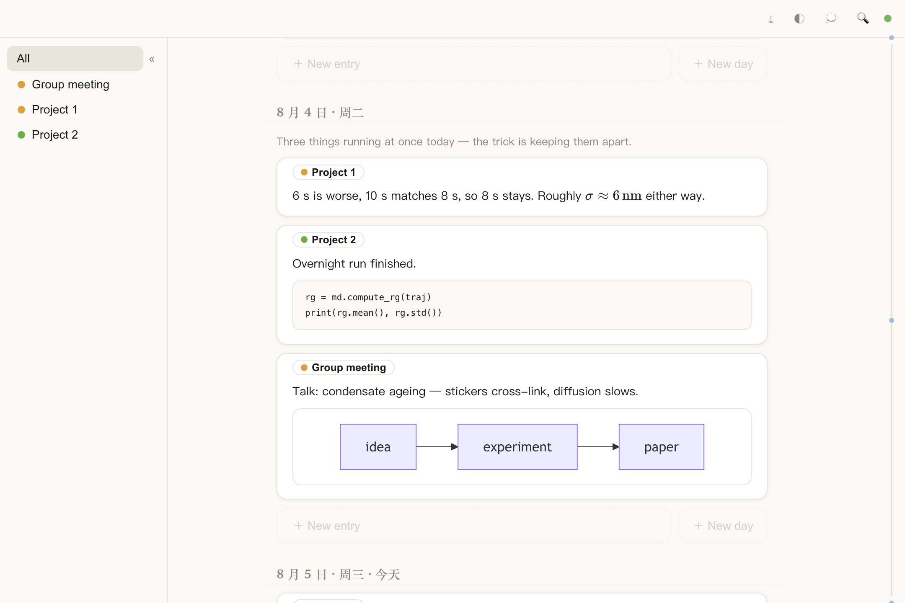
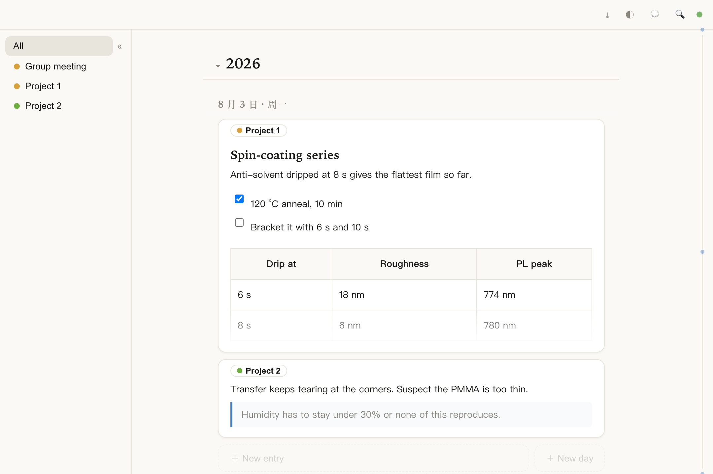
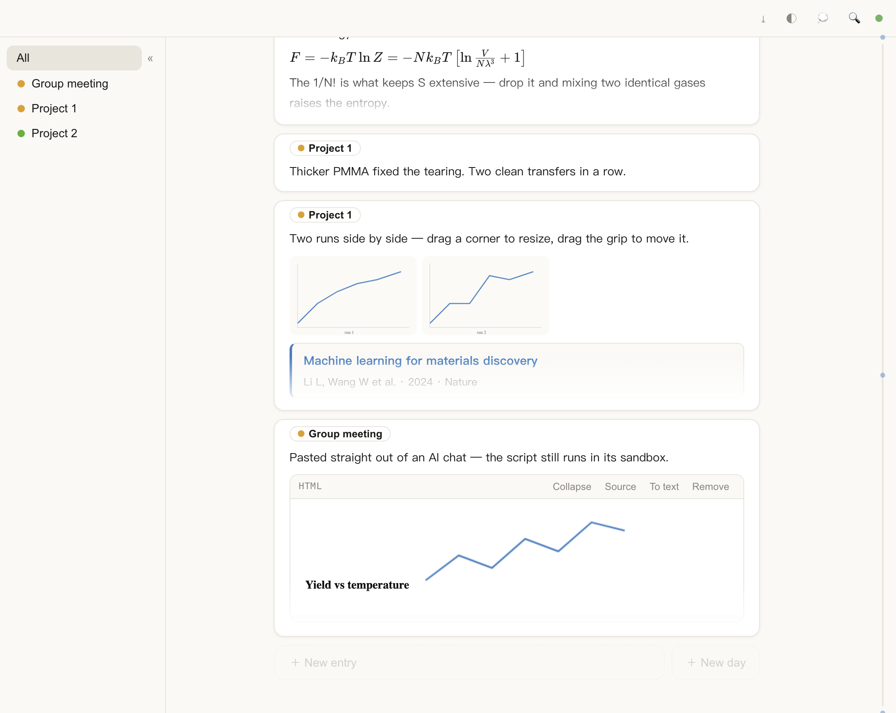

# Mnemos

> The code, the database file and the deploy config still use the early codename
> `parchment`. Renaming them would orphan existing `parchment.db` files, so they
> were left alone. Nothing about the app depends on the name.

A deliberately small web notebook for researchers. It opens on today with the cursor
ready; what you write flows by date and threads by task.

Lighter than Typora and far lighter than Notion or Obsidian — no app to install, no sync
client, no plugin garden. One tab. It is a web page, so the laptop, the lab desktop and
your phone are all just that page, always the same notes.

Where it earns its keep is running several projects at once. Most note apps make you pick
a filing cabinet: one note per project, or one note per day. A Tuesday is both. So every
card is filed twice — **down the page** it is a diary, the day's cards together whatever
they belong to; **across the page** it is a project log, one task's cards lined up over
every date it appeared. You never file anything by hand: pick the task on the card and
both views follow.

Why not just a Markdown editor: research notes are not only prose. Screenshots need to go
in without ceremony, figures need to be resized by hand, a paper is often just a link you
want to drop in, and the charts an AI hands you should stay alive. Mnemos treats all of
that as first-class content rather than attachments.



## What it does

### Writing



- **WYSIWYG that behaves.** `## ` becomes a heading, `- ` a list, `**bold**` bold, ` ``` `
  a code block, `$E=mc^2$` rendered maths, ` ```mermaid ` a flowchart. Selected text raises
  a formatting bar, an empty line raises an insert bar, code blocks carry a language picker.
- **Typora's keyboard map.** ⌘1–⌘6 headings, ⌘K link, ⌘⇧K code block, ⌘⇧\` inline code,
  ⌘T table, ⌘⇧Q quote, ⌘⇧I image, ⌘+/⌘- promote and demote. Taken from Typora's published
  shortcut table, so nothing has to be relearned.
- **Raw Markdown when you want it.** Every card has a `</> Source` toggle: read or edit the
  Markdown behind it, or paste a chunk in from somewhere else and switch back.
- **A note per day.** One line, or several, about the day itself, sitting under the date.
  The 💭 button in the toolbar hides or shows them all.
- **Links without a browser dialog.** ⌘K opens a small card next to the cursor: type or
  paste a URL, Enter applies it, a bare domain gets `https://`. Put the cursor on a link
  later and the same card offers open, edit or remove.

### Everything that isn't prose



- **Images behave like text.** Ctrl+V a screenshot and it uploads itself. Images are inline,
  so several share a line and wrap when they run out of room; hover one to drag it
  elsewhere, resize it or remove it. The server files them under `year/month` and
  de-duplicates by content.
- **References from a link.** Paste a DOI / arXiv / PubMed URL and the title, authors, year
  and journal arrive as a compact citation card. A failed lookup stays an ordinary link
  rather than blocking you.
- **AI output, pasted whole.** A formatted answer becomes editable text; a full HTML
  artifact with scripts becomes a sandboxed embed that still animates, and can be resized,
  collapsed or inspected.

### Keeping track

- **One card, one task.** Pick it in the card's corner or type `#taskname` in the body.
  Click a task in the sidebar for its own timeline across every date. Tasks reorder by
  dragging and carry their own colour.
- **Todos that stay findable.** ⌘⇧X turns the current line into a checkbox (`[] ` works
  too). On the right-hand rail, any day still carrying an unfinished todo shows an orange
  dot instead of a blue one — open a task and the loose ends are visible at a glance.
- **Read a whole task at once.** Inside a task, one button expands or collapses every card
  on screen, so a project reads as continuous prose rather than a stack of four-line
  previews.
- **Findable later.** ⌘P opens a command palette: search the text (Chinese and English both
  work), type a date to jump there, type a task to filter. The rail on the right edge
  scrubs through months and snaps to days that have notes.
- **Nothing is lost.** Typing saves itself a second after you stop; every overwrite and
  every delete snapshots what it replaced, per card, and any snapshot can be restored —
  including a deleted card, whole. ⌘S saves at once and pins that version as a checkpoint
  that later edits will not fold away. Tasks can be renamed, recoloured and reordered, but
  nothing in the interface deletes one. Typing is drafted locally first and re-sent when
  the connection returns.
- **Easy to move in and out.** Old Typora journals (the `##### Mar 12th` shape) import
  wholesale. Exports come three ways: one Markdown file, one per month, or a print-ready
  page you save as PDF — and an exported file imports straight back.

An empty database seeds itself with these help cards and a couple of days of sample notes
across several tasks, so the layout above is what you see before writing anything. They are
ordinary cards; delete them whenever.

## Local development

Node 22+. Two terminals:

```bash
# Terminal 1 — backend on :8787
cd server && npm install && ACCESS_PASSWORD=dev npm run dev

# Terminal 2 — Vite dev server, proxies /api and /images to the backend
cd web && npm install && npm run dev
```

Open the URL Vite prints and log in with `dev`.

Tests:

```bash
cd server && npx vitest run   # 94
cd web && npx vitest run      # 72
```

## Deploying to fly.io

One container; SQLite and the images both live on the mounted volume at `/data`.

First time only:

```bash
fly apps create <your-app> --org personal
fly volumes create parchment_data --app <your-app> --region sin --size 3
fly secrets set ACCESS_PASSWORD='your-password' --app <your-app>
```

Point `app` and `primary_region` in `fly.toml` at what you just created, then every
deploy after that is one line:

```bash
fly deploy --remote-only
```

`--remote-only` builds the image on fly.io, so Docker is not needed locally. Open
`https://<your-app>.fly.dev` and enter the password.

`auto_stop_machines` is on, so the machine sleeps when nobody is using it and wakes on the
next request (a second or two of cold start).

### The routine

Edit locally → `npx vitest run` in both `server/` and `web/` → commit and push to GitHub →
`fly deploy --remote-only`. The volume is never touched by a deploy, so notes and images
survive every release.

### Trying it in Docker

```bash
docker build -t parchment .
docker run --rm -p 8787:8787 -e ACCESS_PASSWORD=dev -v $PWD/.data:/data parchment
```

Without Docker you can run the production build directly: `cd web && npm run build`, then
`cd server && NODE_ENV=production ACCESS_PASSWORD=dev WEB_DIST=../web/dist npm start`.

## Data and backups

Everything sits under `/data`: `parchment.db` (SQLite — notes, tasks, citation cache) and
`images/year/month/` (originals, uncompressed).

```bash
fly ssh sftp get /data/parchment.db ./backup/parchment.db
```

Or use ⤓ in the toolbar for a full zip (Markdown + images + embedded HTML) that any editor
can open.

## Importing old notes

```bash
cd server
node src/importCli.js --dry old-journal.md    # preview, writes nothing
node src/importCli.js old-journal.md          # import for real
```

The parser understands `##### Mar 12th` date headings (including `<span id="260312">`
anchors), `<font color=...>TASK</font>` markers as task attribution, and loose prose right
after a date as that day's note. It only ever adds; it never deletes or overwrites.

## Built with

Hono and better-sqlite3 on the server (FTS5 trigram index, so Chinese and English are both
searchable); Vite, React and TipTap/ProseMirror on the client, with KaTeX and Mermaid
loaded on demand. Single user, single password, session in an HttpOnly cookie.

## Licence

MIT
